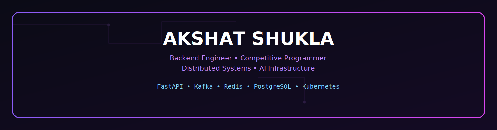

<p align="center">
  
</p>
<p align="center">
Backend Engineer • Competitive Programmer • Distributed Systems • AI Infrastructure
</p>

<h2 align="center">🧠 Backend Philosophy</h2>

<p align="center">
I enjoy building scalable backend systems that prioritize
<b>clean architecture</b>, <b>observability</b>,
<b>fault tolerance</b>, and <b>performance</b>.
My current focus is <b>distributed AI infrastructure</b>,
<b>event-driven microservices</b>, and
<b>cloud-native deployments</b> using FastAPI,
Kafka, PostgreSQL, Redis, and Kubernetes.
</p>

</p>

---


# ⚡ System Status

```text
╔════════════════════════════════════╗

SYSTEM STATUS

🟢 LeetCode

🟢 Codeforces

🟢 FastAPI

🟢 PostgreSQL

🟢 Redis

🟢 Kafka

🟢 Docker


╚════════════════════════════════════╝
```
---

# 🏆 Competitive Programming


<p align="center">

</p>

<p align="center">

</p>

---

# 📈 GitHub Analytics

<p align="center">
  
  
</p>

<p align="center">
  
</p>

# ⚙️ Tech Arsenal

<p align="center">

### 🚀 Backend


</p>

<p align="center">

### 📡 Distributed Systems


</p>

<p align="center">

### 🤖 AI / ML


</p>

<p align="center">

### 🛠 Tools


</p>

---

<h2 align="center">🎯 Current Focus</h2>

<p align="center">

🚀 Kubernetes<br>
🚀 Distributed Systems<br>
🚀 Production Backend Engineering<br>
🚀 AI Infrastructure

</p>

# 🐍 Contribution Snake

<p align="center">
  
</p>

<p align="center">

<a href="https://www.linkedin.com/in/akshat-shukla-a0377a290">

</a>

<a href="https://leetcode.com/u/AkshatPrep/">

</a>

<a href="https://codeforces.com/profile/shukla.aksh18">

</a>

<a href="mailto:shukla.aksh18@gmail.com">

</a>

</p>

---


<h2 align="center">⚡ Always Building</h2>

<p align="center">

<i>
"Building scalable systems today that can survive production tomorrow."
</i>

</p>
