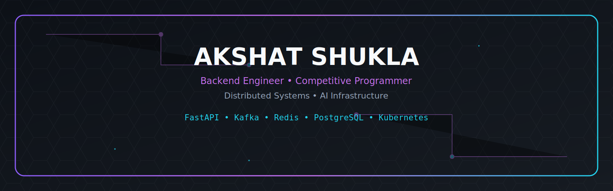

<p align="center">
  
</p>

<p align="center">
<b>Backend Engineer • Competitive Programmer • Distributed Systems • AI Infrastructure</b>
</p>

<p align="center">

</p>

<h2 align="center">🧠 Backend Philosophy</h2>

<p align="center">
I enjoy building scalable backend systems that prioritize <b>clean architecture</b>,
<b>observability</b>, <b>fault tolerance</b>, and <b>performance</b>.
My current focus is <b>distributed AI infrastructure</b>, <b>event-driven microservices</b>,
and <b>cloud-native deployments</b> using FastAPI, Kafka, PostgreSQL, Redis, and Kubernetes.
</p>

<p align="center">

</p>

<p align="center"></p>

## ⚡ System Status

```text
╔════════════════════════════════════╗
SYSTEM STATUS

🟢 LeetCode
🟢 Codeforces
🟢 FastAPI
🟢 PostgreSQL
🟢 Redis
🟢 Kafka
🟢 Docker
🟡 Kubernetes (Learning)

╚════════════════════════════════════╝
```

<p align="center"></p>

<p align="center">

</p>

<p align="center">

</p>

<p align="center"></p>

<p align="center">
  
</p>

<p align="center">

> 🚧 **Active Development**  
> These production-oriented projects are continuously evolving with new features, testing, and deployment improvements.

</p>

<p align="center">

<table align="center" width="82%">
<tr>

<td width="50%" valign="top">

### 🤖 Distributed AI Backend


Production-grade distributed backend.

- ⚡ FastAPI + AsyncIO
- 📨 Apache Kafka
- 🗄 PostgreSQL + Redis
- 🐳 Docker + Kubernetes
- 📊 Prometheus + Grafana
- 🤖 AI Worker Services
- 🔐 JWT Authentication

<a href="https://github.com/Akshat-Shukla2004/distributed-ai-backend">

</a>

</td>

<td width="50%" valign="top">

### 📈 LeetCode Competition Bot


Telegram automation for competitive programming.

- 🔔 Daily reminders
- 👥 Friend tracking
- 🏆 Contest alerts
- ⚙ GitHub Actions
- 🐍 Python

<a href="https://github.com/Akshat-Shukla2004/lc-competition-bot">

</a>

</td>

</tr>
</table>

</p>

<p align="center">

</p>

<p align="center"></p>

<p align="center">

</p>

<p align="center">


</p>

<p align="center">

</p>

<p align="center"></p>

<p align="center">

</p>

<h3 align="center">🚀 Backend</h3>
<p align="center">

</p>

<h3 align="center">📡 Distributed Systems</h3>
<p align="center">

</p>

<h3 align="center">🤖 AI / ML</h3>
<p align="center">

</p>

<h3 align="center">🛠 Tools</h3>
<p align="center">

</p>

<p align="center"></p>

<h2 align="center">🎯 Current Focus</h2>

<p align="center">
🚀 Kubernetes<br>
🚀 Distributed Systems<br>
🚀 Production Backend Engineering<br>
🚀 AI Infrastructure
</p>

<p align="center"></p>

## 🐍 Contribution Snake

<p align="center">

</p>

<p align="center">

</p>

<p align="center">
<a href="https://www.linkedin.com/in/akshat-shukla-a0377a290"></a>
<a href="https://leetcode.com/u/AkshatPrep/"></a>
<a href="https://codeforces.com/profile/shukla.aksh18"></a>
<a href="mailto:shukla.aksh18@gmail.com"></a>
</p>

<p align="center">

</p>
